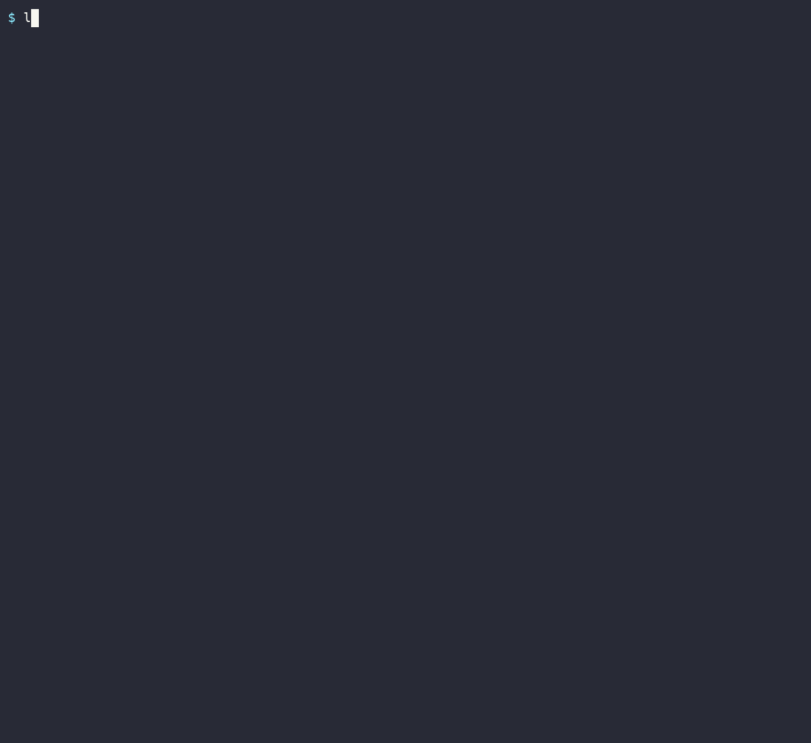

# llamadeck

> **Mission control for local LLMs.** Know whether a model will run on your machine — **before** you download it — then launch and monitor it, all from one terminal app.


`llamadeck` reads just a model's **GGUF header** and predicts whether it fits your VRAM/RAM — **100% GPU, hybrid, CPU, or OOM** — so you never pull 40 GB only to watch it crash. Then it launches the `llama.cpp` server in Docker — on your **GPU or CPU** — and monitors it from a single tabbed TUI. Predictions self-correct against the real footprint of every launch.



---

## Install

llamadeck is a single Go binary. Install it once (steps 1–3), then pick the path
that matches your machine:

- **Just predict fit** — *will this model run, and how?* No GPU, no Docker. Works anywhere.
- **Run models on CPU** — no GPU required; you only need Docker.
- **Run models on GPU** — an NVIDIA GPU, Docker, and the NVIDIA Container Toolkit.

> **Prebuilt binaries and Homebrew ship with the first tagged GitHub release.**
> Until one is published, build from source (below) — it takes about a minute.

### Prerequisites

| To… | You need |
|---|---|
| Build the `llamadeck` binary | Go 1.24+, `git`, `make` |
| Predict model fit | nothing else — no GPU, no Docker |
| Run a model on **CPU** | Docker Engine + Compose v2 |
| Run a model on **GPU** | NVIDIA GPU + driver · Docker Engine + Compose v2 · NVIDIA Container Toolkit |

> **You never need the CUDA toolkit on the host.** The server image compiles
> llama.cpp against CUDA *inside* Docker. A **GPU** run additionally needs the
> NVIDIA **driver** (which ships the CUDA runtime) and the **Container Toolkit** so
> the container can see your GPU; a **CPU** run needs neither.

### 1 · Build & utility packages

The helper scripts use `git`, `make`, `curl`, and `jq`. `fzf` and `figlet` are
optional (nicer pickers / banner).

```bash
# Debian / Ubuntu
sudo apt-get update && sudo apt-get install -y git make curl jq
# optional: sudo apt-get install -y fzf figlet

# Fedora / RHEL
sudo dnf install -y git make curl jq
# optional: sudo dnf install -y fzf figlet

# Arch
sudo pacman -S --needed git make curl jq
# optional: sudo pacman -S fzf figlet
```

### 2 · Install Go (1.24+)

The distro Go package is often too old — install the official toolchain:

```bash
GO_VERSION=1.24.2                       # or newer; use linux-arm64 on ARM hosts
curl -fsSL "https://go.dev/dl/go${GO_VERSION}.linux-amd64.tar.gz" -o /tmp/go.tgz
sudo rm -rf /usr/local/go && sudo tar -C /usr/local -xzf /tmp/go.tgz
echo 'export PATH="/usr/local/go/bin:$PATH"' >> ~/.bashrc   # or ~/.zshrc
export PATH="/usr/local/go/bin:$PATH"
go version                              # should print go1.24.x
```

### 3 · Build & install llamadeck

```bash
git clone https://github.com/xcanonx12/llamadeck.git
cd llamadeck
make install                            # builds predictor/ → installs to ~/.local/bin
export PATH="$HOME/.local/bin:$PATH"    # add to ~/.bashrc / ~/.zshrc to persist
llamadeck                               # verify — prints usage
```

`make install` runs `go build` in `predictor/` and copies the binary to
`~/.local/bin` (override with `make install PREFIX=/usr/local`). To build without
installing, run `make build` — the binary lands at `predictor/llamadeck`. Run the
test suite any time with `make test`.

**Prediction already works** on any machine, no GPU or Docker required:

```bash
llamadeck unsloth/Llama-3.2-1B-Instruct-GGUF:Q4_K_M --ctx 8192
```

### 4 · Run a model

Both paths build a llama.cpp **server image once** (Docker required), then launch
it from the TUI. Pick the one that matches your machine.

#### 🖥️ CPU — no GPU required

1. **Install Docker** (skip if you already have it):
   ```bash
   curl -fsSL https://get.docker.com | sh   # Debian / Ubuntu / Fedora
   sudo pacman -S --needed docker           # Arch
   sudo systemctl enable --now docker
   sudo usermod -aG docker "$USER"          # log out/in for the group change to apply
   ```
2. **Build the server image** from the cloned repo. With no GPU present it builds a
   portable image automatically. The first build compiles llama.cpp (slow, minutes);
   after that it's cached:
   ```bash
   ./docker-build.sh                        # or: llamadeck → Update tab → build
   ```
3. **Launch.** From the repo, start the TUI:
   ```bash
   llamadeck
   ```
   With no GPU, llamadeck opens in **CPU mode** automatically — GPU-only settings
   read `n/a (CPU)` and the fit graph sizes your system **RAM**. In the **Models**
   tab pick a model and press `enter` to preview, `enter` again to open the **Fit**
   tab, then `enter` → `y` to launch. It runs on CPU (`-ngl 0`, no `--gpus`). On a
   machine that *has* a GPU, press `m` in the Fit tab to switch into CPU mode.

Predict from the command line on **any** machine — no Docker, no GPU:

```bash
llamadeck --cpu unsloth/Llama-3.2-1B-Instruct-GGUF:Q4_K_M --ctx 8192
```

#### 🚀 GPU — NVIDIA

You need the NVIDIA driver, Docker, and the NVIDIA Container Toolkit.

**Debian / Ubuntu — one command:** `./check-hardware.sh` verifies the driver and
auto-installs Docker + the Container Toolkit (it prints driver instructions but
never installs kernel modules itself).

For Fedora / Arch, or to do it by hand:

```bash
# Docker Engine
curl -fsSL https://get.docker.com | sh   # Debian / Ubuntu / Fedora
sudo pacman -S --needed docker           # Arch
sudo systemctl enable --now docker
sudo usermod -aG docker "$USER"          # log out/in for the group change to apply
```

Install the **NVIDIA Container Toolkit** from the official guide (the repo/package
differs per distro and is version-sensitive), then wire it into Docker:
<https://docs.nvidia.com/datacenter/cloud-native/container-toolkit/latest/install-guide.html>

```bash
sudo nvidia-ctk runtime configure --runtime=docker
sudo systemctl restart docker
docker run --rm --gpus all ubuntu nvidia-smi   # smoke test: should list your GPU
```

Build the CUDA server image once, then launch from the TUI:

```bash
llamadeck                                # TUI → Update tab → build, then launch a model
./docker-build.sh                        # or headless: auto-detects CUDA version + GPU arch
```

New here? [TUTORIAL.md](TUTORIAL.md) is a 5-minute tour.

## Table of Contents

- [What it does](#what-it-does)
- [The control center (TUI)](#the-control-center-tui)
- [CLI](#cli)
- [Plug a server into your coding agent](#plug-a-server-into-your-coding-agent)
- [How prediction works](#how-prediction-works)
- [The engine: build & run with Docker](#the-engine-build--run-with-docker)
- [Configuration reference](#configuration-reference)
- [How the Docker layer works](#how-the-docker-layer-works)
- [Project layout](#project-layout)
- [Testing](#testing)
- [Troubleshooting](#troubleshooting)
- [FAQ](#faq)
- [Roadmap](#roadmap)
- [Contributing](#contributing)
- [Acknowledgements](#acknowledgements)
- [License](#license)

---

## What it does

Picking a local model is full of sharp edges: which quant fits your GPU, at what
context length, and whether it'll spill to RAM or just OOM — questions you
normally only answer *after* a multi-gigabyte download. And once it runs, you're
juggling Docker, CUDA base images, the NVIDIA Container Toolkit, and model caches
by hand.

llamadeck answers the "will it fit?" question in milliseconds from the GGUF
header, recommends the best quant, then drives the whole build → launch → monitor
loop for you.

- **Fit prediction without downloading.** Range-reads only the header; a
  layer-by-layer engine fills VRAM and spills to RAM, reporting the exact mode
  and the recommended `-ngl`.
- **Per-device multi-GPU prediction.** On `--gpus all`, models the real
  llama.cpp split — layers load-balanced across devices, the main device
  carrying the output + logits buffer — and flags *which* GPU OOMs, not just a
  pooled total.
- **MoE expert offload.** Models `--n-cpu-moe` (keep the first N layers' experts
  on CPU) live in the graph, from exact per-layer expert tensor sizes.
- **Quant advisor.** `recommend` scans every quant in a repo and stars the best
  one that runs fully on your GPU at your context.
- **One control center.** A tabbed TUI: browse/search models, see fit, launch,
  and monitor live GPU + containers.
- **Plugs into your coding agent.** `llamadeck plug` emits — or writes, with
  confirmation and a backup — the provider config that adds a running server to
  Claude Code, OpenCode, Codex, Cursor, Pi, or Hermes.
- **Self-calibrating.** Reads `llama-server`'s real buffer sizes after a launch
  and corrects future predictions — so it gets more accurate the more you use it.
- **Honest.** Weights and KV cache are computed exactly; the fuzzy compute buffer
  is the only estimate, and `verify` reports its error against real launches.
- **Self-contained binary.** Talks to Docker and `nvidia-smi` directly; degrades
  gracefully with no GPU, no Docker, or on macOS.

## The control center (TUI)

```bash
llamadeck            # launch the full TUI
```

Four tabs:

- **Models** — browse curated top models or search Hugging Face; `enter` predicts
  fit, `l` launches the server (on an auto-picked free port).
- **Monitor** — live GPU memory/utilisation bars and managed containers; `s`/`x`
  to stop/remove (htop/nvtop style), `p` to plug the selected server into your
  coding agent (pick agent → see config → copy or write it). Each server shows a
  plain-English readiness line (ready / loading / not-responding / stopped) and
  a download progress bar.
- **Fit** — the colour-coded VRAM/RAM graph for the selected model. `↑/↓` move
  between launch settings, `←/→` adjust the selected one, `e` types a numeric
  value directly, `c` opens the quant picker. On multi-GPU `all`, shows a bar
  per device with the bottleneck GPU flagged. Every knob (ctx, ubatch, KV type,
  `-ngl`, MoE offload) updates the verdict instantly.
- **Update** — build / rebuild the server image (remove → update llama.cpp →
  build) with a live-streamed log, plus a Dev option to build from an alternative
  llama.cpp fork.

First boot detects whether the server image exists and points you to the Update
tab if not. `tab`/`1`–`4` switch tabs, `q` quits.

## CLI

Everything the TUI does is scriptable:

```bash
# Will this model fit? (header only — no download)
llamadeck unsloth/Llama-3.2-1B-Instruct-GGUF:Q4_K_M --ctx 8192

# Which quant should I pull? — scans every quant, picks the best
llamadeck recommend unsloth/Llama-3.2-1B-Instruct-GGUF --ctx 8192

# Explore tradeoffs in the colour-coded graph (single model)
llamadeck tui unsloth/Llama-3.2-1B-Instruct-GGUF:Q4_K_M

# Learn from a real launch to sharpen predictions
llamadeck calibrate unsloth/Llama-3.2-1B-Instruct-GGUF:Q4_K_M --container <name> --ctx 8192

# Report prediction accuracy against a real launch (read-only)
llamadeck verify unsloth/Llama-3.2-1B-Instruct-GGUF:Q4_K_M --container <name> --ctx 8192
```

`calibrate`, `verify` and `audit` read the server's load-time allocation lines,
which current llama.cpp hides at the default log verbosity. Launch the server
you intend to measure with `--extra "-lv 9"`, or those commands have nothing to
read.

Source forms accepted everywhere: `owner/repo[:QUANT]`, a direct `.gguf` URL, or a
local path. Hardware is auto-probed (`nvidia-smi` + `/proc/meminfo` / `sysctl`);
override with `--vram-mb` / `--ram-mb`. Full reference:
[`predictor/README.md`](predictor/README.md).

## Plug a server into your coding agent

Once a server runs, `llamadeck plug` produces the exact provider config your
coding agent needs — and can write it for you:

```bash
llamadeck plug                  # running servers + supported agents
llamadeck plug codex            # print the ready-to-paste snippet
llamadeck plug codex --write    # add it to ~/.codex/config.toml (y/N + backup)
```

| Agent | What you get | `--write` |
|---|---|---|
| `claude` (Claude Code) | `env` block + one-shot shell prefix — uses llama-server's native Anthropic `/v1/messages` | project `.claude/settings.local.json` (`--global` for `~/.claude/settings.json`) |
| `opencode` | `provider.llamadeck` for `opencode.json` | deep-merge, other providers untouched |
| `codex` | provider + profile → `codex --profile llamadeck` | marked block in `~/.codex/config.toml`, default model untouched |
| `cursor` | GUI values + steps (print-only: Cursor routes via its backend, needs a public tunnel; only chat honors the override) | — |
| `pi` | `providers.llamadeck` for `~/.pi/agent/models.json` | deep-merge |
| `hermes` | `model:` block for `~/.hermes/config.yaml` | only creates the file or replaces its own block — never edits a foreign config |

The model id and context window are probed live from the server (`/v1/models`,
`/props`); re-running `plug --write` overwrites only the llamadeck entry, with
a timestamped backup every time. Servers launched without `--jinja` get a
warning — llama.cpp needs it for tool calling.

The same flow lives in the TUI: on the **Monitor** tab, select a server and
press `p` — pick the agent, then `y` copies the snippet or `w` writes it
(same confirmation and backup).

## How prediction works

Memory splits into four buckets; llamadeck fills VRAM layer-by-layer (mirroring
`-ngl` — llama.cpp offloads the **last** `-ngl` blocks, and so does the engine)
and spills the rest to RAM:

| Bucket | Source | Accuracy |
|---|---|---|
| **Weights** | ≈ GGUF file size (summed across shards) | exact |
| **KV cache** | `2 · n_kv_heads · head_dim · ctx · bytes` per *attention* layer | exact |
| **Recurrent state** | conv + SSM state per *recurrent* layer (hybrid/SSM models) | validated |
| **Compute buffer** | logits + activation heuristic | estimate → calibrated |
| **CUDA base** | per-GPU runtime overhead constant | empirical |

The KV-cache math is pinned by a golden test across six real architectures
(diverse GQA ratios, Gemma's 256 head-dim). On hybrid attention+SSM models only
the true attention layers pay KV; recurrent layers get a fixed-size state buffer
instead (validated byte-exact against a real launch: 8.375 MiB per recurrent
layer on Qwen3.5-9B). The compute buffer is the one estimate, biased
conservative and corrected per-host by `calibrate`, which parses the real buffer
sizes `llama-server` prints at load time.

On `--gpus all` the engine mirrors llama.cpp's two split regimes. With **auto**
`-ngl` it load-balances the fitted layers across devices — the last device
reserves its output + logits buffer first, so layers pile onto the roomier
device (validated on a dual-3080: predicted 13/1 split matched the real auto-fit
exactly). With an **explicit** `-ngl` llama.cpp does *not* auto-fit — it splits
blocks proportionally to per-device free VRAM, blind to the compute buffer, so
the main device can overload; the engine reproduces that split (validated
against a real dual-3080 crash-loop launch: the measured 11/7 block split and
buffer sizes match) and flags *which* GPU OOMs before you launch.

llama.cpp also needs **more VRAM at load time than its buffer log admits**
(CUDA context, scheduler reserves — measured at ~250 MiB/GPU dense, ~690
MiB/GPU hybrid). The engine reserves a measured **load margin** (512 MiB/GPU
default, calibrated per host): auto fits stay inside it by construction, and an
explicit `-ngl` that lands within it is flagged **⚠ TIGHT — may crash at
load**, with the largest safe `-ngl` computed for you. Launching a
predicted-crash config from the TUI asks for explicit confirmation, on
free-VRAM values re-probed at that moment.

Predictions are validated against **real launches** — KV exact, VRAM weights
within ~1%, compute conservatively over-predicted (6–12%). See
[`predictor/VALIDATION.md`](predictor/VALIDATION.md), including the load-margin
measurement campaign.

> **Known limitations (accuracy).** Hybrid attention+SSM models (Qwen3-Next /
> Qwen3.5 "Gated Delta Net", Mamba, Jamba) are modeled — recurrent-state
> buffers, per-layer KV-vs-RS accounting, the explicit-`-ngl` device split —
> but flagged **approximate** (like MLA), and the recurrent-state size assumes
> llama-server's default 4 parallel sequences. Verify against a real launch.

---

## The engine: build & run with Docker

Under the TUI is a reproducible Docker workflow (also usable standalone as Bash
scripts). Build a CUDA-accelerated `llama.cpp` server image **once**, then run as
many model servers as you like — each in its own container, all sharing **one
local model cache** so nothing is re-downloaded.

### Prerequisites

| Requirement | Notes |
|---|---|
| NVIDIA GPU + driver | Required for launch/build. `check-hardware.sh` detects it and prints install instructions if missing (it will **not** auto-install drivers). |
| Docker Engine + Compose v2 | Auto-installed by `check-hardware.sh` if missing. |
| NVIDIA Container Toolkit | Auto-installed and configured by `check-hardware.sh` if missing. |
| `curl`, `jq` | Auto-installed (used for Hugging Face quant discovery). |
| `fzf`, `figlet` | **Optional.** Nicer pickers / banner when present; clean fallback otherwise. |

Tested on Ubuntu 24.04 with CUDA 12.9 (RTX 4050) and dual RTX 3080.

### 1. Preflight

```bash
./check-hardware.sh
```

Verifies the GPU/driver, Docker, the Container Toolkit, and `curl`/`jq`,
installing the safe userland pieces as needed. Exits non-zero with copy-paste
instructions if the NVIDIA driver is missing or too old.

### 2. Build the image (once)

```bash
./docker-build.sh
```

- Reads your driver's max CUDA version → selects the matching `nvidia/cuda` base tag and writes it to `.env`.
- Detects your GPU's compute capability → compiles for **only** that architecture.
- Clones `llama.cpp` (shallow) if not already present.
- Builds `local/llama.cpp:server-cuda` (CUDA server + bundled WebUI).

Pass `--no-build` to do everything except the final image build. *(The Config tab
in the TUI does this with a live log.)*

### 3. Launch a model

Interactively via `./menu.sh`, or non-interactively:

```bash
# Explicit quant
./launch.sh --model unsloth/Qwen3-VL-8B-Instruct-GGUF --quant Q5_K_M --port 7000

# Let the toolkit discover and pick a quant
./launch.sh --model unsloth/Llama-3.2-1B-Instruct-GGUF --port 7001

# Tuned: context, GPU layers, parallel slots, and a raw passthrough flag
./launch.sh --model unsloth/Qwen3-VL-8B-Instruct-GGUF --quant Q4_K_M \
  --port 7002 --ctx 16384 --ngl 999 --parallel 4 --extra "--no-mmap"
```

Each launch renders a self-contained `compose/<name>.yml` and runs
`docker compose up -d`. Use `--dry-run` to render without starting. Open the
printed URL (e.g. `http://localhost:7000`) for the bundled WebUI, or hit the
OpenAI-compatible API directly:

```bash
curl http://localhost:7000/v1/chat/completions \
  -H "Content-Type: application/json" \
  -d '{"messages":[{"role":"user","content":"Say hello in one short sentence."}]}'
```

### 4. Manage running servers

```bash
./manage.sh status              # list every managed server: state / health / port
./manage.sh logs   <container>  # follow logs
./manage.sh stop   <container>  # stop one
./manage.sh rm     <container>  # force-remove one
```

`stop`/`rm`/`logs` without a name open an interactive picker. All operate on
containers carrying the `com.llamacpp.managed=true` label.

## Configuration reference

### `launch.sh` flags

| Flag | Default | Description |
|---|---|---|
| `--model <repo>` | *(required)* | Hugging Face GGUF repo, e.g. `unsloth/Llama-3.2-1B-Instruct-GGUF`. |
| `--quant <Q>` | auto-discovered | Quant tag, e.g. `Q4_K_M`. If omitted, the first discovered quant is used (the menu lets you pick). |
| `--port <N>` | `8080` | Host **and** container port (mapped 1:1). |
| `--ctx <N>` | `32768` | Context size (`--ctx-size`). |
| `--ngl <N>` | `999` | GPU layers (`-ngl`); `999` ≈ all layers on GPU. |
| `--parallel <N>` | *(server default)* | Parallel request slots (`--parallel`). |
| `--flash-attn on\|off` | `on` | Flash attention. |
| `--context-shift on\|off` | `on` | Context shifting. |
| `--alias <name>` | *(none)* | Model name reported by the API (`--alias`). |
| `--restart <policy>` | `unless-stopped` | Docker restart policy. |
| `--extra "<flags>"` | *(none)* | Raw flags passed straight to `llama-server`. |
| `--dry-run` | off | Render the compose file but don't start the container. |

### `.env`

| Variable | Default | Description |
|---|---|---|
| `UBUNTU_VERSION` | `24.04` | Base image Ubuntu version. |
| `CUDA_VERSION` | `12.9.0` | Auto-set by `docker-build.sh` from your driver. |
| `GCC_VERSION` | `14` | Compiler pinned for the CUDA build. |
| `MODELS_DIR` | `./.models` | Host directory for the shared model cache. |

`NO_COLOR` disables all ANSI colour output (CLI and scripts). All three build
variables are optional — `docker-build.sh` defaults them (`GCC_VERSION` follows
`UBUNTU_VERSION`: `14` for 24.04, `12` for 22.04) and writes them back to `.env`.

### NVIDIA DGX Spark (GB10) and other unified-memory parts

Spark, Jetson and friends have no dedicated VRAM: the GPU and CPU share one
LPDDR pool, and `nvidia-smi` reports the memory columns as `[N/A]`. llamadeck
detects that, uses the host pool as the memory budget, and — because it is the
*same* memory — requires GPU + host bytes to fit it **together** instead of
budgeting two pools.

`docker-build.sh` auto-selects `dgx.Dockerfile` on `aarch64` + a unified GPU:
CUDA 13 base (needed for `sm_121`), native Grace CPU build instead of the x86
`GGML_CPU_ALL_VARIANTS` set, and `GGML_CUDA_ENABLE_UNIFIED_MEMORY=1` at runtime
(free here, since a spill stays in the same RAM). Force either file with
`DOCKERFILE=Dockerfile ./docker-build.sh`.

## How the Docker layer works

```
check-hardware.sh ──▶ docker-build.sh ──▶ local/llama.cpp:server-cuda
                                                 │
       menu.sh / launch.sh ──(render)──▶ compose/<name>.yml ──(up -d)──▶ labeled container
                                                 │
                       bind mount: ${MODELS_DIR:-./.models} ──▶ /root/.cache/huggingface
```

- **One image, many containers.** Built once; every model is just a container started from it.
- **Compose per model.** Each launch writes a standalone `compose/<name>.yml`. Deleting it forgets the model; no shared state to corrupt.
- **Label-based management.** Containers are tagged `com.llamacpp.managed=true` and `com.llamacpp.model=<repo>:<quant>`; tooling finds them via `docker ps --filter label=...`.
- **GPU access** via the Compose `deploy.resources.reservations.devices` block (the modern equivalent of `--gpus all`) — no `runtime: nvidia` daemon config.
- **Shared cache** binds `MODELS_DIR` to `/root/.cache/huggingface` (where `llama.cpp -hf` writes), so a model pulled once is reused everywhere.

## Project layout

```
predictor/          llamadeck — the Go app (engine, TUI, CLI); see predictor/README.md
  fit/              GGUF parser, allocation engine, calibration, HF resolver, advisor
  app/              tabbed TUI: Models / Monitor / Fit / Update
  infra/            Docker + nvidia-smi + launch/build; cross-platform mem probe
  hub/              curated top models, HF search, shared model loader
  tui/              the colour-coded fit graph
Dockerfile          Multi-stage build: WebUI (Node) → CUDA compile → slim server image
docker-build.sh     CUDA tag + GPU-arch detection, clone llama.cpp, build the image
check-hardware.sh   GPU/driver/Docker/toolkit preflight + safe auto-install
launch.sh           Non-interactive launcher: flags → compose/<name>.yml → up -d
menu.sh             Interactive launcher over launch.sh
manage.sh           status / logs / stop / rm for managed containers
lib/common.sh       Shared Bash helpers
demo/               README GIF + reproducible recorder (make demo)
compose/ .models/   Generated per-model compose + shared cache (git-ignored)
```

## Testing

```bash
cd predictor && go test ./...   # Go: engine, accuracy table, parsers, app smoke (offline)
bash tests/run_all.sh           # Bash unit tests (no Docker/network)
./test.sh                       # end-to-end: launch a tiny model, assert a completion
```

The predictor's math is guarded by an **audit corpus**: real launch logs +
their configs under `predictor/fit/testdata/audit/`, replayed by `go test`
bucket-by-bucket (weights, KV+recurrent state, compute, per-device placement,
verdict-vs-outcome), each with its own tolerance — a regression names the exact
bucket and config that drifted. The same checks run against a live server via
`llamadeck audit <model> --container <name> [flags]`, so drift in a new
llama.cpp build or model family is pinpointed in seconds.

CI (GitHub Actions) runs `go vet` + `go test` + `go build` and `shellcheck` on
every push.

## Troubleshooting

| Symptom | Cause & fix |
|---|---|
| `unknown or invalid runtime name: nvidia` | A compose file is requesting the legacy `nvidia` runtime. Launch via `launch.sh`/`menu.sh`, which use the `deploy.devices` block. |
| `get_repo_commit: error: HTTPS is not supported` | Image built without OpenSSL. Rebuild — the Dockerfile installs `libssl-dev`, which `llama.cpp` needs for `-hf` over HTTPS. |
| Models re-download every launch | The cache must mount to `/root/.cache/huggingface`. `launch.sh` resolves `MODELS_DIR` to an absolute path so the per-model compose binds the repo-root cache. |
| Build takes forever | `docker-build.sh` detects your compute capability and builds only that arch. If you bypassed it, pass `CUDA_DOCKER_ARCH=<cc>` (e.g. `89`). |
| `Port <N> is already in use` | Another process holds the port. The TUI auto-picks a free one; for `launch.sh` pass `--port`, or stop the old server via `manage.sh`. |
| `nvidia-smi not found` | Install the NVIDIA driver (preflight prints the commands), then re-run. |
| "Docker unusable" although Docker is installed (e.g. DGX OS) | The banner now prints why. Usually socket permissions: `sudo usermod -aG docker "$USER"` then `newgrp docker` (or re-login); or the daemon is stopped: `sudo systemctl enable --now docker`. |
| GPU shows 0 B of memory | Unified-memory part (DGX Spark / Jetson) reporting `[N/A]` to `nvidia-smi` — handled since the unified-memory support; if it persists, check `nvidia-smi --query-gpu=name --format=csv,noheader` and add the name to `isUnifiedGPU` in `predictor/infra/docker.go` + `is_unified_gpu` in `lib/common.sh`. |
| Server stuck "starting" for minutes | First launch downloads the model; large models can exceed the healthcheck `start_period`. Watch `manage.sh logs <name>`. |
| Container keeps **restarting** (exit 139) despite VRAM to spare | A CUDA compute-buffer OOM at load (`cudaMalloc failed … failed to allocate compute buffers`). Usually a too-large `--ubatch-size` with a big-vocab model (the logits buffer scales with ubatch × vocab). The Fit graph now predicts this per-device — the overloaded GPU is flagged ⚠ before launch, near-edge fits warn **TIGHT — may crash at load**, and the largest safe `-ngl` is shown. Lower ubatch/ctx, or pin one GPU. `--restart unless-stopped` hides the crash — check `logs`. |
| `warning: failed to mlock … Cannot allocate memory` | The container's `RLIMIT_MEMLOCK` is Docker's tiny default. The Go launcher now passes `--ulimit memlock=-1` automatically when mlock is on; for the bash scripts, turn mlock off or add the ulimit yourself. |

## FAQ

**Does prediction need a GPU or Docker?**
No. `predict`/`recommend` work anywhere — they only read the GGUF header. GPU +
Docker are needed to actually launch and to build the image.

**Where are my downloaded models?**
In `MODELS_DIR` (default `./.models`), a standard Hugging Face hub cache.

**Can I run multiple models at once?**
Yes — each gets its own port (the TUI auto-picks free ones) and shares the image
and cache.

**How accurate is the prediction?**
Weights and KV cache are computed exactly. The compute buffer is an estimate that
self-corrects via `calibrate`; `verify` shows the error against a real launch.

## Roadmap

- **Fix hybrid-arch prediction** — ✅ done: recurrent-state buffers + per-layer
  KV-vs-RS accounting + the real explicit-`-ngl` layer split for attention+SSM
  models (Qwen3-Next / Qwen3.5 / Mamba / Jamba), validated against a real launch.
- **Per-quant tensor sizing in the picker** — ✅ done: exact tensors are rescaled
  per quant, so each quant gets its own verdict.
- **Live throughput in Monitor** — poll the `llama-server` REST API for per-server tokens/sec and load.
- **Auto-calibrating launches** — feed each server's startup log into `calibrate` automatically on launch.
- **Per-GPU layer distribution** — ✅ done: per-device split + which-GPU-OOMs
  verdict on `--gpus all`, load-balanced like llama.cpp's auto-fit.
- **Wire calibration into the TUI launch flow** — auto-`calibrate` after a launch.

## Contributing

Issues and PRs welcome. Before submitting:

1. `cd predictor && go test ./...` and `go vet ./...`.
2. Run `bash tests/run_all.sh`; if you have a GPU, `./test.sh`.
3. Keep Bash scripts `set -euo pipefail` and `shellcheck`-clean.

## Acknowledgements

Built on [`ggml-org/llama.cpp`](https://github.com/ggml-org/llama.cpp); the
`Dockerfile` derives from the project's official server Dockerfile. TUI by
[Bubble Tea](https://github.com/charmbracelet/bubbletea) + Lip Gloss.

## License

[MIT](LICENSE). `llama.cpp` itself is MIT-licensed.
